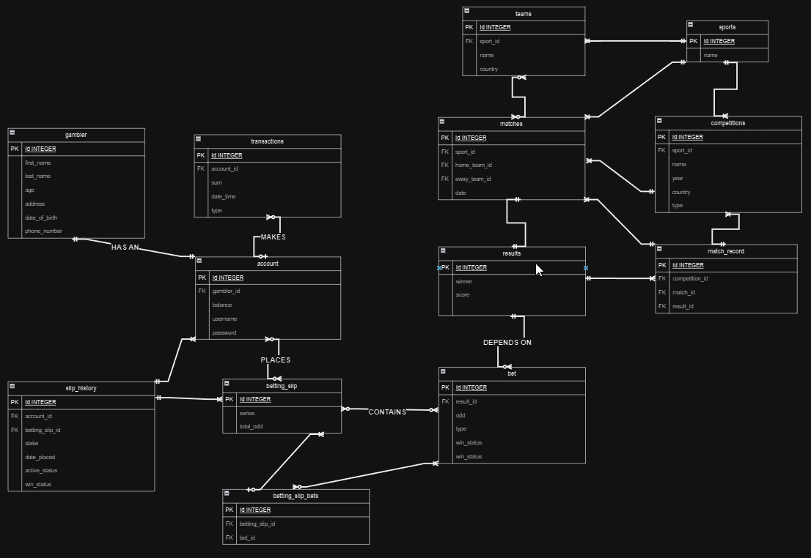

# Design Document

By Diaconescu Rares-Theodor

Video overview: <https://youtu.be/85W9haHjSCA>

## Scope

### Purpose
The purpose of the database is to manage a platform for online sports betting. It allows users to register, place bets on upcoming matches, view past results, manage their accounts, and track their betting history.

### Included in Scope
- **Gamblers**: Individuals who register on the platform to participate in sports betting.
- **Matches**: Sporting events with information such as date, participating teams, and results.
- **Betting Slips**: Collections of bets placed by users on upcoming matches.
- **Accounts**: User accounts associated with gamblers, containing information like balance and login credentials.
- **Transactions**: Records of financial transactions including deposits, withdrawals, and betting slip placements.

### Outside Scope
- Detailed player statistics.
- Live streaming of matches.
- Legal and regulatory compliance beyond basic user authentication and transaction logging.

### Out of Scope
- Providing real-time odds updates.
- Offering customer support services.
- Integration with external payment gateways.

## Functional Requirements

### User Abilities
Users should be able to:
- Register and authenticate as gamblers.
- View upcoming matches for specific teams, sports, and competitions.
- Place bets on matches.
- View past match results.
- Manage their betting slips.
- Deposit and withdraw funds from their accounts.

### Representation

### Entities

1. **Gambler**
   - Attributes: ID (Integer), First Name (Text), Last Name (Text), Age (Integer), Address (Text), Date of Birth (Date), Phone Number (Text)
   - Types:
     - ID: Integer for unique identification.
     - Age: Integer to represent the age of the gambler.
   - Constraints:
     - Age must be 18 or older to comply with legal requirements.

2. **Account**
   - Attributes: ID (Integer), Gambler ID (Integer), Balance (Real), Username (Text), Password (Text)
   - Types:
     - ID: Integer for unique identification.
     - Balance: Real for monetary values.
   - Constraints:
     - Username and password are required for authentication.
     - Password must be at least 8 characters long for security.

3. **Betting Slip**
   - Attributes: ID (Integer), Series (Text), Total Odd (Real)
   - Types:
     - ID: Integer for unique identification.
     - Total Odd: Real for representing odds.
   - Constraints:
     - Total odd must be greater than 1 for a valid betting slip.

4. **Slip History**
   - Attributes: ID (Integer), Account ID (Integer), Betting Slip ID (Integer), Stake (Real), Date Placed (Datetime), Active Status (Integer), Win Status (Integer)
   - Types:
     - ID: Integer for unique identification.
     - Stake: Real for monetary values.
     - Date Placed: Datetime for recording the date and time of placing the slip.
   - Constraints:
     - Stake must be greater than 0 for a valid slip.
     - Active status can only be 0 or 1.
     - Win status can be NULL, 0, or 1.

5. **Bet**
   - Attributes: ID (Integer), Result ID (Integer), Odd (Real), Type (Text), Win Status (Integer)
   - Types:
     - ID: Integer for unique identification.
     - Odd: Real for representing odds.
   - Constraints:
     - Odd must be greater than 1 for a valid bet.
     - Win status can be NULL, 0, or 1.

6. **Betting Slip Bets**
   - Attributes: ID (Integer), Betting Slip ID (Integer), Bet ID (Integer)

7. **Results**
   - Attributes: ID (Integer), Winner (Text), Score (Text)
   - Constraints:
     - Winner must be '1', 'X', or '2' to represent match outcomes.

8. **Matches**
   - Attributes: ID (Integer), Date (Date), Sport ID (Integer), Home Team ID (Integer), Away Team ID (Integer)

9. **Competitions**
   - Attributes: ID (Integer), Name (Text), Year (Text), Country (Text), Sport ID (Integer), Type (Text)

10. **Match Record**
    - Attributes: ID (Integer), Competition ID (Integer), Match ID (Integer), Result ID (Integer)

11. **Teams**
    - Attributes: ID (Integer), Name (Text), Country (Text), Sport ID (Integer)

12. **Transactions**
    - Attributes: ID (Integer), Account ID (Integer), Sum (Real), Type (Text), Date Time (Datetime)

13. **Sports**
    - Attributes: ID (Integer), Name (Text)

### Relationships

!

- **Gambler** has a one-to-one relationship with **Account**.

- **Account** has many-to-one relationship with **Slip History**, a one-to-many relationship with **Transactions** and a many-to-many relationship with **Betting Slip**.

- **Betting Slip** has a many-to-many relationship with **Account**, a many-to-one relationship with **Betting Slip Bets**, a many-to-one relationship with **Slip History** and a many to many relationship with **Bet**.

- **Slip History** has a one-to-many relationship with **Betting Slip** and **Account**. It keeps the history of every betting slip an account has placed and it acts like a junction table between **Betting Slip** and **Account**.

- **Bet** has a many-to-many relationship with **Betting Slip** through **Betting Slip Bets**(junction table).

- **Results** has a one-to-many relationship with **Bet** and an one-to-one relationship with **Matches**.

- **Matches** has many-to-many relationships with **Teams** and an many-to-one relationship with **Sports**.

- **Match Record** links **Matches**, **Results** and **Competitions**.

- **Teams** has a many-to-many relationship with **Matches**, and a many-to-one relationship with **Sports**.

- **Competitions** has a one-to-many relationship with **Matches** and a many-to-one relationship with **Sports**.

## Optimizations

### Indexes
- **Betting Slip Info View:** Indexed on `slip_id` for efficient retrieval of information about specific betting slips.
- **Following Matches View:** Indexed on `home_team_id`, `away_team_id`, `date`, `sport_id`, and `competition_id` for faster access to upcoming matches.
- **Past Results View:** Indexed on `home_team_id`, `away_team_id`, `date`, `sport_id`, and `competition_id` for quicker retrieval of past match results.
- **History of Betting View:** Indexed on `gambler_id` to speed up access to betting history for specific gamblers.
- **Active Betting Slips:** Indexed on `account_id` and `active_status` for efficient retrieval of active betting slips for specific gamblers.
- **Transactions Table:** Indexed on `date_time` and `account_id` for faster access to transactions within specific date ranges and for specific accounts.

## Limitations

### Design Limitations
- The database design does not include detailed player statistics or real-time odds updates, which may limit its ability to provide comprehensive betting insights.
- It may not fully address legal and regulatory compliance requirements beyond basic user authentication and transaction logging.

### Representation Limitations
- The database might struggle to represent complex multi-leg bets or exotic bet types commonly found in advanced sports betting platforms.
- Detailed historical data analysis and reporting capabilities are limited in this design, potentially hindering in-depth performance evaluation and trend analysis.

